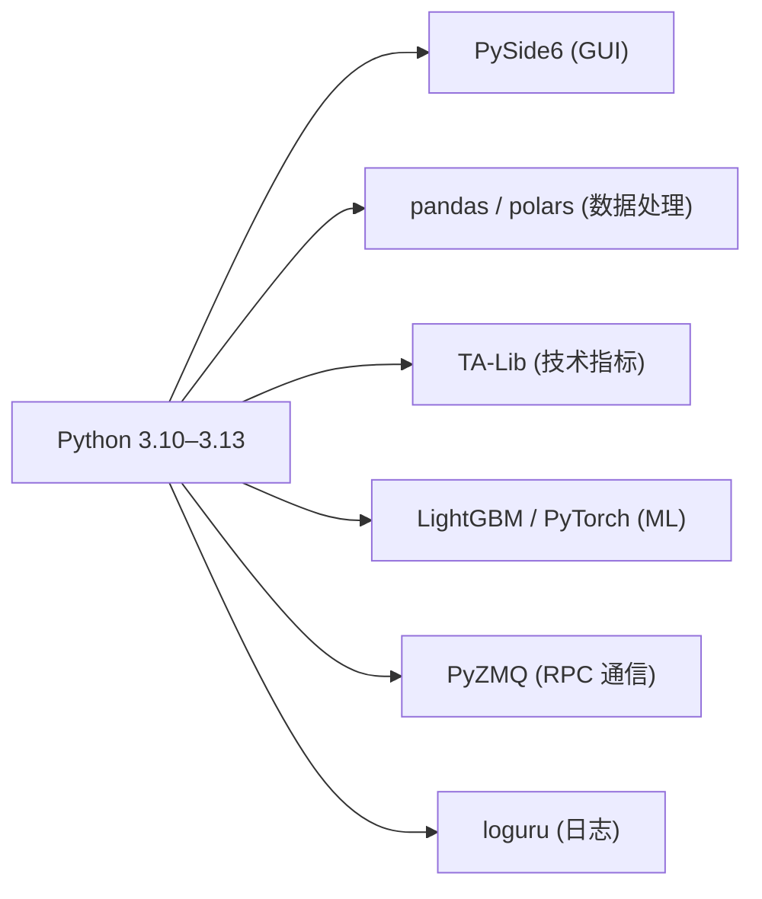

# VeighNa 项目概览

<cite>
**参考文件**
- [pyproject.toml](file://pyproject.toml)
- [vnpy/__init__.py](file://vnpy/__init__.py)
- [vnpy/trader/engine.py](file://vnpy/trader/engine.py)
- [vnpy/alpha/__init__.py](file://vnpy/alpha/__init__.py)
</cite>

## 项目简介

VeighNa（vnpy）是一套面向专业量化交易员的 **AI-Powered 开源量化交易框架**，核心理念为 "By Traders, For Traders"。项目基于 MIT 许可证发布，当前版本为 **4.4.0**。

**Sources** · [vnpy/__init__.py:24](file://vnpy/__init__.py#L24) · [pyproject.toml:1-7](file://pyproject.toml#L1-L7)

## 核心能力

| 能力方向 | 说明 |
|---------|------|
| **多市场接入** | 覆盖国内期货（CFFEX/SHFE/CZCE/DCE/INE/GFEX）、证券（SSE/SZSE/BSE）、期权及海外市场（IB/NASDAQ/NYSE/CME 等），共 30+ 交易接口 |
| **AI 量化研究** | `vnpy.alpha` 模块提供一站式多因子机器学习策略方案，涵盖特征工程（dataset）、模型训练（model）、策略开发（strategy）、投研实验室（lab） |
| **全流程应用** | CTA 策略、价差交易、期权定价、组合策略、算法交易、风控管理、数据录制等 10+ 开箱即用 App |
| **GUI 交易平台** | 基于 PySide6 的桌面交易界面，含 K 线图表、订单管理、行情显示等 |

## 技术栈



**Sources** · [pyproject.toml:24-41](file://pyproject.toml#L24-L41)

## 运行环境

- **操作系统**：Windows 11+ / Server 2022+、Ubuntu 22.04 LTS+、macOS（含 Apple Silicon）
- **Python**：≥ 3.10（64 位），推荐 3.13
- **构建系统**：hatchling ≥ 1.27.0
- **推荐部署**：VeighNa Studio 4.4.0 一体化发行版

## 依赖分组

| 分组 | 用途 | 关键依赖 |
|------|------|---------|
| **主依赖** | 核心交易功能 | PySide6==6.8.2.1, pandas, numpy, ta-lib, pyzmq, loguru, plotly |
| **alpha** | AI 量化研究 | polars, scipy, scikit-learn, lightgbm, torch, pyarrow |
| **dev** | 开发环境 | pandas-stubs, hatchling, babel |

**Sources** · [pyproject.toml:25-59](file://pyproject.toml#L25-L59)

## 目录结构

```
vnpy/
├── alpha/          # AI 量化研究模块（dataset/model/strategy/lab）
├── chart/          # K 线图表组件（基于 pyqtgraph）
├── event/          # 事件驱动引擎
├── rpc/            # RPC 通信框架（客户端/服务端）
├── trader/         # 核心交易模块（引擎/网关/对象/工具）
│   ├── ui/         # GUI 界面组件
│   ├── locale/     # 国际化资源
│   ├── engine.py   # MainEngine + OmsEngine + LogEngine
│   ├── gateway.py  # BaseGateway 抽象网关
│   ├── object.py   # 数据对象（Tick/Bar/Order/Trade/Position 等）
│   ├── constant.py # 枚举常量（交易所/方向/状态等）
│   ├── utility.py  # 工具函数（BarGenerator/ArrayManager）
│   └── converter.py# 开平转换器
├── examples/       # 示例脚本和 Notebook
├── tests/          # 测试用例
└── docs/           # 文档资源
```

## 安装方式

| 平台 | 安装脚本 |
|------|---------|
| Windows | `install.bat` |
| Ubuntu | `install.sh` |
| macOS | `install_osx.sh` |

## 总结

VeighNa 是一套架构成熟、功能全面的量化交易框架，以事件驱动为核心，通过插件化的网关和应用体系支持多市场全品种交易，同时集成了 AI 量化研究能力，适合从策略研发到实盘部署的完整工作流。
