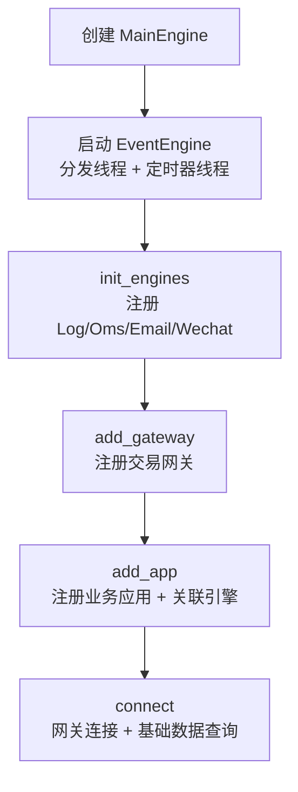
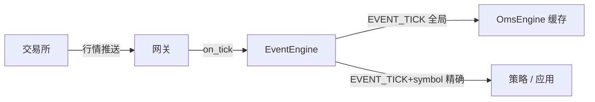
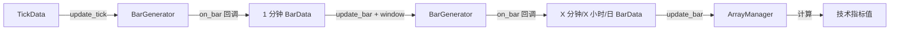
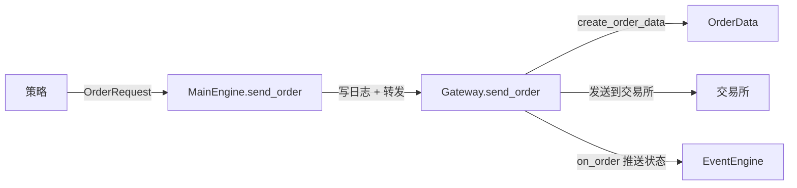
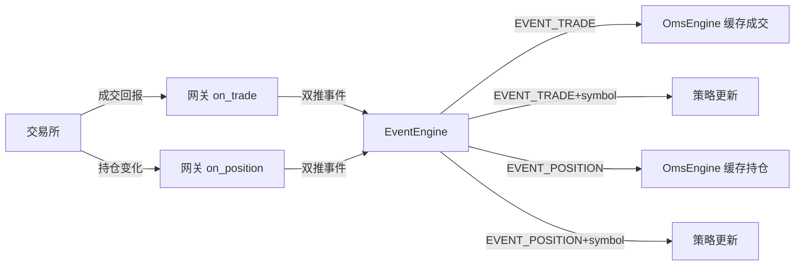
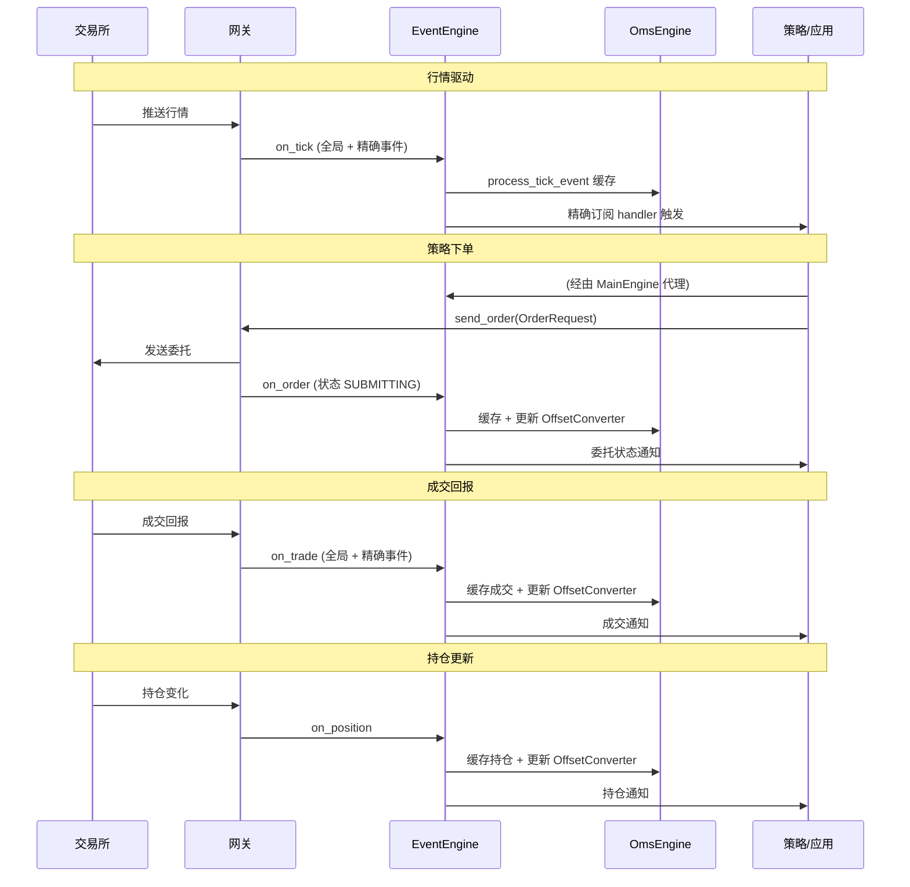

# 交易工作流与数据流

<cite>
**参考文件**
- [vnpy/trader/engine.py](file://vnpy/trader/engine.py)
- [vnpy/trader/gateway.py](file://vnpy/trader/gateway.py)
- [vnpy/event/engine.py](file://vnpy/event/engine.py)
- [vnpy/trader/utility.py](file://vnpy/trader/utility.py)
- [vnpy/trader/converter.py](file://vnpy/trader/converter.py)
- [vnpy/trader/database.py](file://vnpy/trader/database.py)
- [vnpy/trader/datafeed.py](file://vnpy/trader/datafeed.py)
- [vnpy/trader/setting.py](file://vnpy/trader/setting.py)
</cite>

## 概述

本文档从**运行时视角**串联 VeighNa 各核心组件，描述行情流入、策略处理、下单执行、回报更新、数据持久化的完整数据流转路径。与 [核心架构](/核心架构)（静态结构）和 [模块总览](/模块总览)（模块划分）互补，回答"组件之间在运行时如何协作"。

## 平台启动与初始化



[MainEngine](file://vnpy/trader/engine.py#L81-L324) 构造时自动完成以下初始化：

1. **启动事件引擎**：创建 [EventEngine](file://vnpy/event/engine.py#L33-L146) 并调用 `start()`，同时启动事件分发线程（`_run`）和定时器线程（`_run_timer`，默认 1 秒间隔）
2. **注册内置引擎**：[init_engines()](file://vnpy/trader/engine.py#L138-L166) 依次注册 LogEngine、OmsEngine、EmailEngine、WechatEngine，并将 OmsEngine 的查询方法代理到 MainEngine 上（如 `self.get_tick = oms_engine.get_tick`）
3. **注册网关**：`add_gateway()` 创建网关实例并收集其支持的交易所
4. **注册应用**：`add_app()` 创建 App 实例，并通过 `add_engine()` 自动创建其关联的功能引擎
5. **连接网关**：`connect(setting, gateway_name)` 调用网关的 `connect()`，网关在连接成功后查询并推送合约、资金、持仓、委托、成交等基础数据

**Sources** · [vnpy/trader/engine.py:86-101](file://vnpy/trader/engine.py#L86-L101) · [vnpy/trader/engine.py:138-166](file://vnpy/trader/engine.py#L138-L166)

## 行情数据流（Tick → 策略）



行情数据从交易所到策略的流转路径：

1. **网关接收**：交易接口网关接收到交易所推送的行情快照
2. **回调推送**：网关调用 [on_tick(tick)](file://vnpy/trader/gateway.py#L93-L99)，通过 `on_event()` 向事件引擎推送**两个事件**：
   - `EVENT_TICK`（全局行情事件，值 `"eTick."`）
   - `EVENT_TICK + tick.vt_symbol`（精确行情事件，按合约订阅）
3. **事件分发**：EventEngine 的分发线程从队列取出事件，按类型调用已注册的 handler
4. **OMS 缓存**：[OmsEngine.process_tick_event](file://vnpy/trader/engine.py#L394-L397) 将 tick 存入 `self.ticks[vt_symbol]` 字典，供查询
5. **策略处理**：策略/应用通过 `event_engine.register(EVENT_TICK + vt_symbol, handler)` 精确订阅特定合约行情

### 事件订阅模式

| 模式 | 方法 | 适用场景 |
|------|------|---------|
| **精确订阅** | `register(EVENT_TICK + vt_symbol, handler)` | 监听单个合约的行情 |
| **全局订阅** | `register(EVENT_TICK, handler)` | 监听所有合约的行情 |
| **通用订阅** | `register_general(handler)` | 监听全部类型事件（调试/日志） |

所有行情/交易事件类型（`eTick.`、`eOrder.`、`eTrade.`、`ePosition.`、`eAccount.`、`eQuote.`、`eContract.`）均以 `.` 结尾，用于前缀拼接精确订阅标识。

**Sources** · [vnpy/trader/gateway.py:86-99](file://vnpy/trader/gateway.py#L86-L99) · [vnpy/event/engine.py:66-78](file://vnpy/event/engine.py#L66-L78) · [vnpy/trader/engine.py:384-397](file://vnpy/trader/engine.py#L384-L397)

## K 线合成与技术指标

策略通常基于 K 线（Bar）而非原始 Tick 运行，[BarGenerator](file://vnpy/trader/utility.py#L166-L485) 负责将 Tick 合成为 K 线：



| 合成路径 | 方法 | 说明 |
|---------|------|------|
| Tick → 1 分钟 Bar | `update_tick(tick)` | 按分钟边界合成，通过 `on_bar` 回调推送 |
| 1 分钟 → X 分钟 Bar | `update_bar(bar)` + `window` 参数 | X 须能整除 60 |
| 1 分钟 → X 小时 Bar | `update_bar(bar)` + `interval=Interval.HOUR` + `window` | 跨分钟合成小时线 |
| 1 分钟 → 日 Bar | `update_bar(bar)` + `interval=Interval.DAILY` + `daily_end` | 按收盘时间合成日线 |

[ArrayManager](file://vnpy/trader/utility.py#L488-L1273) 以固定长度 numpy 数组存储 OHLCV 时序，封装 TA-Lib 指标计算，支持 `array=True` 返回完整序列或 `array=False` 返回最新值。

**Sources** · [vnpy/trader/utility.py:166-485](file://vnpy/trader/utility.py#L166-L485) · [vnpy/trader/utility.py:488-1273](file://vnpy/trader/utility.py#L488-L1273)

## 下单与撤单流程



下单的完整调用链：

1. **策略发起**：策略构造 [OrderRequest](file://vnpy/trader/object.py)（含 symbol/exchange/direction/offset/order_type/price/volume），调用 `main_engine.send_order(req, gateway_name)`
2. **引擎转发**：[MainEngine.send_order](file://vnpy/trader/engine.py#L254-L264) 写日志后调用 `gateway.send_order(req)`
3. **网关处理**：网关通过 `OrderRequest.create_order_data()` 创建 [OrderData](file://vnpy/trader/object.py)，分配唯一 orderid，发送到交易所
4. **状态推送**：网关调用 [on_order(order)](file://vnpy/trader/gateway.py#L109-L115)，推送 `EVENT_ORDER`（全局）和 `EVENT_ORDER + vt_orderid`（精确）
5. **返回标识**：`send_order()` 返回 `vt_orderid`（格式 `gateway_name.orderid`），策略据此跟踪委托

撤单流程类似：策略构造 `CancelRequest` → `main_engine.cancel_order()` → `gateway.cancel_order()` → 交易所。

**Sources** · [vnpy/trader/engine.py:254-274](file://vnpy/trader/engine.py#L254-L274) · [vnpy/trader/gateway.py:197-212](file://vnpy/trader/gateway.py#L197-L212)

## 成交与持仓回报



交易回报的处理流程：

| 事件 | 网关回调 | OmsEngine 处理 | OffsetConverter 更新 |
|------|---------|---------------|---------------------|
| 成交 | `on_trade()` | `process_trade_event` 缓存到 `trades` | `update_trade()` |
| 委托状态 | `on_order()` | `process_order_event` 缓存 + 维护 `active_orders` | `update_order()` |
| 持仓 | `on_position()` | `process_position_event` 缓存到 `positions` | `update_position()` |
| 资金 | `on_account()` | `process_account_event` 缓存到 `accounts` | — |
| 合约 | `on_contract()` | `process_contract_event` 缓存 + 初始化 OffsetConverter | — |

**Sources** · [vnpy/trader/engine.py:384-461](file://vnpy/trader/engine.py#L384-L461)

## 开平转换机制

[OffsetConverter](file://vnpy/trader/converter.py#L310-L403) 处理中国期货市场特有的开平仓逻辑，贯穿下单与回报全流程：

1. **初始化**：网关推送合约时（`on_contract` → `process_contract_event`），[OmsEngine 为每个网关创建一个 OffsetConverter 实例](file://vnpy/trader/engine.py#L441-L448)
2. **实时更新**：每笔委托/成交/持仓事件都会同步更新 OffsetConverter 的冻结量追踪，防止超量平仓
3. **下单转换**：策略可通过 [OmsEngine.convert_order_request](file://vnpy/trader/engine.py#L566-L581) 请求转换，支持：
   - **SHFE/INE 今昨平**：区分平今（CLOSETODAY）与平昨（CLOSEYESTERDAY）
   - **锁仓模式**（`lock=True`）：反向开仓代替平仓
   - **净仓模式**（`net=True`）：直接平仓，自动拆分今/昨

**Sources** · [vnpy/trader/engine.py:441-448](file://vnpy/trader/engine.py#L441-L448) · [vnpy/trader/converter.py:310-403](file://vnpy/trader/converter.py#L310-L403)

## 数据持久化与历史数据

VeighNa 采用**插件式**数据层，通过抽象基类 + 动态导入工厂解耦具体实现：

```mermaid
graph TB
    Settings["vt_setting.json<br/>database.name / datafeed.name"]
    Settings --> DBFactory["get_database()"]
    Settings --> DFFactory["get_datafeed()"]
    DBFactory -->|import vnpy_{name}| DB["BaseDatabase 实现"]
    DFFactory -->|import vnpy_{name}| DF["BaseDatafeed 实现"]
    DB --> BarTick["Bar/Tick 数据存取"]
    DF --> History["历史行情查询"]
```

### 数据库层

[BaseDatabase](file://vnpy/trader/database.py#L52-L133) 定义了 Bar/Tick 数据的 CRUD 抽象接口，[get_database()](file://vnpy/trader/database.py#L139-L159) 单例工厂根据 `SETTINGS["database.name"]` 动态导入 `vnpy_{name}` 模块（默认 `sqlite` → `vnpy_sqlite`），找不到时回退到 SQLite。

### 数据源层

[BaseDatafeed](file://vnpy/trader/datafeed.py#L10-L33) 定义了历史 K 线/Tick 查询接口，[get_datafeed()](file://vnpy/trader/datafeed.py#L39-L68) 单例工厂根据 `SETTINGS["datafeed.name"]` 动态导入 `vnpy_{name}` 模块，未配置时返回空实现。

### 全局配置

[setting.py](file://vnpy/trader/setting.py) 定义 `SETTINGS` 字典（字体/日志/邮件/数据源/数据库），默认值被 `vt_setting.json` 文件覆盖。数据库默认使用 SQLite（`database.db`），时区取系统本地时区。

**Sources** · [vnpy/trader/database.py:52-159](file://vnpy/trader/database.py#L52-L159) · [vnpy/trader/datafeed.py:10-68](file://vnpy/trader/datafeed.py#L10-L68) · [vnpy/trader/setting.py:11-43](file://vnpy/trader/setting.py#L11-L43)

## 完整交易时序



## 总结

VeighNa 的运行时数据流以 **EventEngine** 为中枢，遵循统一的"网关回调 → 双推事件（全局 + 精确）→ OMS 缓存 + 策略处理"模式。行情、委托、成交、持仓等各类数据走完全相同的流转路径，仅事件类型不同。OffsetConverter 在此流程中贯穿始终，实时维护冻结量以确保开平仓正确性。数据持久化层通过插件式工厂模式支持多种数据库和数据源，与交易流程解耦。