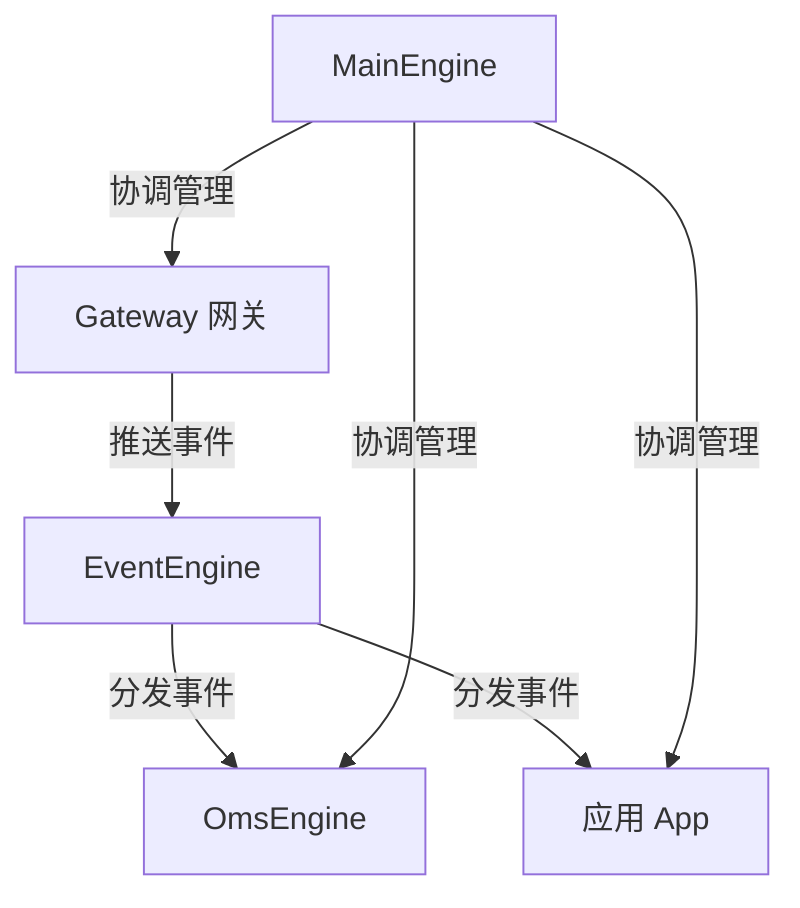
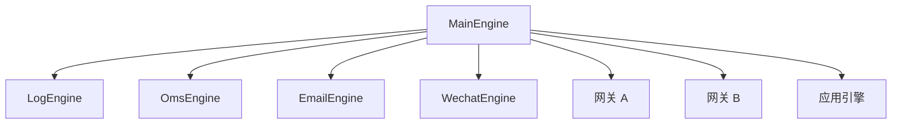

# 核心架构

<cite>
**参考文件**
- [vnpy/event/engine.py](file://vnpy/event/engine.py)
- [vnpy/trader/engine.py](file://vnpy/trader/engine.py)
- [vnpy/trader/gateway.py](file://vnpy/trader/gateway.py)
- [vnpy/trader/object.py](file://vnpy/trader/object.py)
- [vnpy/trader/event.py](file://vnpy/trader/event.py)
- [vnpy/trader/constant.py](file://vnpy/trader/constant.py)
- [vnpy/trader/converter.py](file://vnpy/trader/converter.py)
- [vnpy/trader/app.py](file://vnpy/trader/app.py)
</cite>

## 事件驱动引擎

VeighNa 的整体架构基于**事件驱动**模式，所有组件通过事件引擎进行解耦通信。

### EventEngine 工作原理

[EventEngine](file://vnpy/event/engine.py#L33-L146) 是事件分发的核心枢纽：

1. **事件队列**：使用线程安全的 `Queue` 作为事件缓冲
2. **分发线程**：从队列中取出事件，按类型分发给已注册的 handler
3. **定时器**：每隔 1 秒（可配置）自动生成 `EVENT_TIMER` 定时事件
4. **注册机制**：支持按事件类型注册 handler，也支持注册全局 handler（监听所有类型）

### 事件类型体系

[事件类型](file://vnpy/trader/event.py) 采用字符串前缀匹配设计，支持精准订阅：

| 事件常量 | 值 | 说明 |
|---------|-----|------|
| `EVENT_TIMER` | `eTimer` | 定时器事件（每秒触发） |
| `EVENT_TICK` | `eTick.` | 行情快照（拼接 vt_symbol 可精确订阅） |
| `EVENT_ORDER` | `eOrder.` | 委托状态（拼接 vt_orderid 可精确订阅） |
| `EVENT_TRADE` | `eTrade.` | 成交回报（拼接 vt_symbol 可精确订阅） |
| `EVENT_POSITION` | `ePosition.` | 持仓变化 |
| `EVENT_ACCOUNT` | `eAccount.` | 账户资金 |
| `EVENT_CONTRACT` | `eContract.` | 合约信息 |
| `EVENT_QUOTE` | `eQuote.` | 报价状态 |
| `EVENT_LOG` | `eLog` | 日志输出 |

**Sources** · [vnpy/event/engine.py:13](file://vnpy/event/engine.py#L13) · [vnpy/trader/event.py:7-14](file://vnpy/trader/event.py#L7-L14)

## MainEngine — 平台核心

[MainEngine](file://vnpy/trader/engine.py#L81-L324) 是交易平台的入口和协调中心，职责包括：

1. **启动事件引擎**：构造时自动创建并启动 EventEngine
2. **注册网关**：通过 `add_gateway()` 添加交易接口
3. **注册功能引擎**：通过 `add_engine()` 添加功能模块
4. **注册应用**：通过 `add_app()` 添加业务应用（自动注册其关联的 engine）
5. **初始化内置引擎**：`init_engines()` 自动注册 LogEngine、OmsEngine、EmailEngine、WechatEngine
6. **代理交易操作**：提供 `connect()`、`subscribe()`、`send_order()`、`cancel_order()` 等统一接口

**Sources** · [vnpy/trader/engine.py:81-166](file://vnpy/trader/engine.py#L81-L166)

## OmsEngine — 订单管理系统

[OmsEngine](file://vnpy/trader/engine.py#L360-L587) 提供订单管理（OMS）功能，是数据查询的统一入口：

- **数据缓存**：在内存中维护 ticks、orders、trades、positions、accounts、contracts、quotes 的字典缓存
- **事件驱动更新**：监听各类市场事件和交易事件，自动更新缓存
- **查询 API**：提供 `get_tick()`、`get_order()` 等单个查询和 `get_all_*()` 批量查询方法
- **活跃委托跟踪**：维护 `active_orders` 和 `active_quotes` 字典
- **开平转换**：每个网关对应一个 [OffsetConverter](file://vnpy/trader/converter.py#L310-L403)，处理期货合约的今平/昨平逻辑

**Sources** · [vnpy/trader/engine.py:360-587](file://vnpy/trader/engine.py#L360-L587)

## BaseGateway — 交易网关抽象

[BaseGateway](file://vnpy/trader/gateway.py#L33-L273) 定义了交易网关的标准接口：

### 必须实现的抽象方法

| 方法 | 说明 |
|------|------|
| `connect(setting)` | 建立连接，查询合约/资金/持仓/委托 |
| `close()` | 断开连接 |
| `subscribe(req)` | 订阅行情 |
| `send_order(req)` | 发送委托，返回 vt_orderid |
| `cancel_order(req)` | 撤销委托 |
| `query_account()` | 查询资金 |
| `query_position()` | 查询持仓 |

### 可选实现的方法

| 方法 | 说明 |
|------|------|
| `send_quote(req)` | 发送双边报价 |
| `cancel_quote(req)` | 撤销报价 |
| `query_history(req)` | 查询历史 K 线 |

### 回调推送

网关通过 `on_tick()`、`on_order()` 等回调方法将数据推送到事件引擎，每个回调会同时推送**全局事件**和**带标识的精确事件**（如 `EVENT_TICK + vt_symbol`），实现按合约精确订阅。

**Sources** · [vnpy/trader/gateway.py:86-151](file://vnpy/trader/gateway.py#L86-L151)

## 数据对象体系

[数据对象](file://vnpy/trader/object.py) 采用 `@dataclass` 定义，以 `BaseData` 为基类：

### 行情数据

| 对象 | 说明 |
|------|------|
| `TickData` | 行情快照（最新价/涨跌停/5 档盘口/成交量等） |
| `BarData` | K 线数据（开高低收/成交量/持仓量） |

### 交易数据

| 对象 | 说明 |
|------|------|
| `OrderData` | 委托单（类型/方向/开平/价格/数量/状态） |
| `TradeData` | 成交记录（一单可对应多笔成交） |
| `PositionData` | 持仓（方向/总量/冻结/均价/盈亏） |
| `AccountData` | 账户资金（余额/冻结/可用） |
| `QuoteData` | 双边报价 |

### 请求对象

| 对象 | 说明 |
|------|------|
| `SubscribeRequest` | 行情订阅请求 |
| `OrderRequest` | 委托下单请求 |
| `CancelRequest` | 撤单请求 |
| `HistoryRequest` | 历史数据查询请求 |
| `QuoteRequest` | 报价请求 |

### 统一标识

所有数据对象在 `__post_init__` 中自动生成 `vt_symbol`（格式 `symbol.exchange`），交易相关对象还会生成 `vt_orderid`（格式 `gateway_name.orderid`）等全局唯一标识。

**Sources** · [vnpy/trader/object.py:17-428](file://vnpy/trader/object.py#L17-L428)

## 枚举常量

[constant.py](file://vnpy/trader/constant.py) 定义了交易领域的所有枚举类型：

| 枚举 | 说明 | 典型值 |
|------|------|--------|
| `Exchange` | 交易所 | CFFEX, SHFE, SSE, NASDAQ, CME 等 40+ |
| `Direction` | 方向 | LONG, SHORT, NET |
| `Offset` | 开平 | OPEN, CLOSE, CLOSETODAY, CLOSEYESTERDAY |
| `Status` | 委托状态 | SUBMITTING, NOTTRADED, PARTTRADED, ALLTRADED, CANCELLED, REJECTED |
| `Product` | 品种 | EQUITY, FUTURES, OPTION, ETF, BOND 等 |
| `OrderType` | 委托类型 | LIMIT, MARKET, STOP, FAK, FOK |
| `Interval` | K 线周期 | MINUTE, HOUR, DAILY, WEEKLY, TICK |
| `Currency` | 货币 | USD, HKD, CNY, CAD |

所有枚举均支持国际化（通过 `_()` 包裹中文显示文本）。

**Sources** · [vnpy/trader/constant.py:1-161](file://vnpy/trader/constant.py#L1-L161)

## BaseApp — 应用插件

[BaseApp](file://vnpy/trader/app.py) 定义了应用插件的标准结构：

| 属性 | 说明 |
|------|------|
| `app_name` | 唯一应用名 |
| `app_module` | 应用模块导入路径（用于 import_module） |
| `app_path` | 应用文件夹的绝对路径 |
| `engine_class` | 关联的功能引擎类 |
| `display_name` | GUI 菜单显示名 |
| `widget_name` | GUI 组件类名 |
| `icon_name` | 图标文件名 |

应用通过 `MainEngine.add_app()` 注册，自动创建其关联的引擎实例。

## OffsetConverter — 开平转换器

[OffsetConverter](file://vnpy/trader/converter.py) 处理中国期货市场的特有的开平仓逻辑：

- **SHFE/INE**（上期所/能源中心）：需区分平今（CLOSETODAY）和平昨（CLOSEYESTERDAY）
- **锁仓模式**：通过反向开仓代替平仓
- **净仓模式**：直接平仓，自动拆分今/昨
- **冻结量追踪**：实时计算活跃委托的冻结持仓，防止超量平仓

**Sources** · [vnpy/trader/converter.py:17-403](file://vnpy/trader/converter.py#L17-L403)

## 通知系统

框架内置两种通知渠道：

1. **EmailEngine**：通过 SMTP 发送邮件通知，使用后台线程异步发送
2. **WechatEngine**：通过微信推送通知，支持扫码绑定、会话过期重连、消息合并限速

`MainEngine.send_notification()` 会同时通过两个渠道推送。

**Sources** · [vnpy/trader/engine.py:590-839](file://vnpy/trader/engine.py#L590-L839)

## 总结

VeighNa 核心架构以 **EventEngine** 为通信中枢，**MainEngine** 为管理入口，通过 **BaseGateway** 抽象交易接口、**BaseApp** 抽象业务应用，配合 **OmsEngine** 统一管理交易数据，形成高度可扩展的插件化交易框架。

各组件的运行时协作流程详见 [交易工作流与数据流](/交易工作流与数据流)，模块划分详见 [模块总览](/模块总览)。
