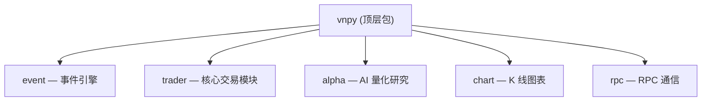
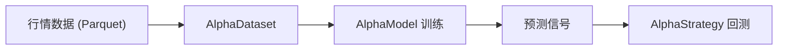

# 模块总览

<cite>
**参考文件**
- [vnpy/trader/](file://vnpy/trader/)
- [vnpy/event/](file://vnpy/event/)
- [vnpy/alpha/](file://vnpy/alpha/)
- [vnpy/chart/](file://vnpy/chart/)
- [vnpy/rpc/](file://vnpy/rpc/)
</cite>

## 模块架构总览

## vnpy.event — 事件引擎

**路径**：`vnpy/event/`

独立的事件驱动基础设施，不依赖交易业务逻辑。

| 文件 | 说明 |
|------|------|
| `engine.py` | `Event` 事件对象 + `EventEngine` 事件分发引擎 |
| `__init__.py` | 导出 Event, EventEngine, EVENT_TIMER |

核心特性：
- 基于线程 + 队列的事件分发
- 1 秒间隔定时器事件
- 按类型注册 handler / 全局 handler
- 线程安全、自动去重

**Sources** · [vnpy/event/engine.py](file://vnpy/event/engine.py)

---

## vnpy.trader — 核心交易模块

**路径**：`vnpy/trader/`

框架的核心模块，包含交易引擎、网关接口、数据对象、工具函数等全部交易基础设施。

### 子模块结构

| 文件/目录 | 说明 |
|-----------|------|
| `engine.py` | **MainEngine**（平台核心）+ **OmsEngine**（订单管理）+ **LogEngine**（日志）+ **EmailEngine**（邮件）+ **WechatEngine**（微信通知） |
| `gateway.py` | **BaseGateway** 抽象网关类，定义连接/下单/撤单/行情订阅标准接口 |
| `object.py` | 全部数据对象定义（TickData / BarData / OrderData / TradeData / PositionData / AccountData / ContractData / QuoteData + 请求对象） |
| `constant.py` | 枚举常量（Exchange / Direction / Offset / Status / Product / OrderType / Interval / Currency） |
| `event.py` | 事件类型字符串常量 |
| `converter.py` | **OffsetConverter** 开平转换器（处理今平/昨平/锁仓逻辑） |
| `utility.py` | **BarGenerator** K 线合成器 + **ArrayManager** 技术指标容器 + 工具函数 |
| `setting.py` | 全局配置（字体/日志/邮件/数据源/数据库） |
| `app.py` | **BaseApp** 应用插件抽象基类 |
| `database.py` | 数据库接口 |
| `datafeed.py` | 数据源接口 |
| `logger.py` | 基于 loguru 的日志系统 |
| `wechat.py` | 微信推送底层实现 |
| `optimize.py` | 参数优化 |
| `ui/` | GUI 界面组件（基于 PySide6） |
| `locale/` | 国际化资源（中英文） |

### BarGenerator — K 线合成器

[BarGenerator](file://vnpy/trader/utility.py#L166-L485) 支持多周期 K 线合成：

| 功能 | 说明 |
|------|------|
| Tick → 1 分钟 K 线 | `update_tick()` 实时合成 |
| 1 分钟 → X 分钟 K 线 | `update_bar()` + window 参数，X 须整除 60 |
| 1 分钟 → X 小时 K 线 | `update_bar()` + interval=HOUR |
| 1 分钟 → 日 K 线 | `update_bar()` + interval=DAILY + daily_end 收盘时间 |

### ArrayManager — 技术指标容器

[ArrayManager](file://vnpy/trader/utility.py#L488-L1273) 封装了 numpy 数组 + TA-Lib 指标计算：

- **基础数据**：open / high / low / close / volume / turnover / open_interest 时序数组
- **均线指标**：SMA、EMA、KAMA、WMA
- **动量指标**：RSI、MACD、APO、PPO、MOM、ROC、CMO、TRIX
- **波动指标**：ATR、NATR、STD、Bollinger Band、Keltner Channel、Donchian Channel
- **趋势指标**：ADX、ADXR、DX、Aroon、SAR、ULTOSC
- **量价指标**：OBV、MFI、AD、ADOSC、BOP
- **随机指标**：Stochastic (KDJ)

所有指标支持 `array=True` 返回完整时序或 `array=False` 返回最新值。

**Sources** · [vnpy/trader/utility.py](file://vnpy/trader/utility.py)

---

## vnpy.alpha — AI 量化研究

**路径**：`vnpy/alpha/`

一站式多因子机器学习策略模块，提供从数据到策略的完整工作流。

### 子模块结构

| 子模块 | 说明 |
|--------|------|
| `dataset/` | **AlphaDataset** — 特征工程与数据集管理，支持多因子表达式注册 |
| `model/` | **AlphaModel** — 模型训练与预测，集成 LightGBM / PyTorch 等 |
| `strategy/` | **AlphaStrategy** + **BacktestingEngine** — 策略开发与回测 |
| `lab.py` | **AlphaLab** — 投研实验室，管理数据/模型/信号/合约的持久化 |
| `logger.py` | 模块级日志 |

### AlphaLab 工作流

AlphaLab 管理以下数据目录：

| 目录 | 存储格式 | 说明 |
|------|---------|------|
| `daily/` | Parquet | 日 K 线数据 |
| `minute/` | Parquet | 分钟 K 线数据 |
| `component/` | shelve | 指数成分股 |
| `dataset/` | pickle | 序列化的 AlphaDataset |
| `model/` | pickle | 序列化的 AlphaModel |
| `signal/` | Parquet | 预测信号 DataFrame |

**Sources** · [vnpy/alpha/lab.py](file://vnpy/alpha/lab.py) · [vnpy/alpha/__init__.py](file://vnpy/alpha/__init__.py)

---

## vnpy.chart — K 线图表

**路径**：`vnpy/chart/`

基于 pyqtgraph 的高性能 K 线图表组件。

| 文件 | 说明 |
|------|------|
| `widget.py` | **ChartWidget** 图表主组件 |
| `item.py` | **CandleItem** K 线绘制 + **VolumeItem** 成交量绘制 |
| `axis.py` | 坐标轴定制 |
| `base.py` | 图表基础定义 |
| `manager.py` | 数据管理器 |

**Sources** · [vnpy/chart/__init__.py](file://vnpy/chart/__init__.py)

---

## vnpy.rpc — RPC 通信

**路径**：`vnpy/rpc/`

基于 ZeroMQ 的 RPC 通信框架，支持客户端/服务端架构的分布式交易部署。

| 文件 | 说明 |
|------|------|
| `server.py` | **RpcServer** RPC 服务端 |
| `client.py` | **RpcClient** RPC 客户端 |
| `common.py` | 通信协议定义 |

**Sources** · [vnpy/rpc/__init__.py](file://vnpy/rpc/__init__.py)

---

## 总结

| 模块 | 定位 | 关键类 |
|------|------|--------|
| `vnpy.event` | 事件驱动基础设施 | EventEngine, Event |
| `vnpy.trader` | 核心交易引擎 | MainEngine, OmsEngine, BaseGateway, BarGenerator, ArrayManager |
| `vnpy.alpha` | AI 量化研究 | AlphaDataset, AlphaModel, AlphaStrategy, AlphaLab |
| `vnpy.chart` | K 线图表 | ChartWidget, CandleItem, VolumeItem |
| `vnpy.rpc` | 分布式通信 | RpcServer, RpcClient |
