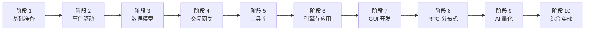

# 量化交易软件开发学习计划

<cite>
**参考文件**
- [vnpy/event/engine.py](file://vnpy/event/engine.py)
- [vnpy/trader/engine.py](file://vnpy/trader/engine.py)
- [vnpy/trader/object.py](file://vnpy/trader/object.py)
- [vnpy/trader/gateway.py](file://vnpy/trader/gateway.py)
- [vnpy/trader/utility.py](file://vnpy/trader/utility.py)
- [vnpy/trader/converter.py](file://vnpy/trader/converter.py)
- [vnpy/alpha/lab.py](file://vnpy/alpha/lab.py)
- [vnpy/rpc/server.py](file://vnpy/rpc/server.py)
- [examples/](file://examples/)
</cite>

## 学习路线总览



---

## 阶段 1：基础准备（1–2 周）

### 目标
搭建开发环境，理解量化交易的基本概念和项目全局架构。

### 1.1 环境搭建

- 安装 Python 3.13（64 位）
- 克隆本项目，执行 `pip install -e .` 安装
- 安装 alpha 可选依赖：`pip install -e ".[alpha]"`
- 安装 dev 工具：`pip install -e ".[dev]"`
- 配置 IDE（PyCharm / VSCode），开启 ruff 和 mypy 检查

### 1.2 领域知识储备

| 概念 | 对应代码位置 | 学习目标 |
|------|-------------|---------|
| 交易所 | [constant.py](file://vnpy/trader/constant.py) `Exchange` | 理解 CFFEX/SHFE/SSE 等 40+ 交易所枚举 |
| 合约品种 | `constant.py` `Product` | 股票/期货/期权/ETF/债券等品种分类 |
| 方向/开平 | `constant.py` `Direction` / `Offset` | 多/空/净，开仓/平仓/平今/平昨 |
| 委托类型 | `constant.py` `OrderType` | 限价/市价/STOP/FAK/FOK |
| K 线周期 | `constant.py` `Interval` | 分钟/小时/日/周/Tick |

### 1.3 阅读顺序

1. [vnpy/__init__.py](file://vnpy/__init__.py) — 了解版本号
2. [pyproject.toml](file://pyproject.toml) — 了解依赖和项目结构
3. [vnpy/trader/constant.py](file://vnpy/trader/constant.py) — 通读所有枚举，建立领域词汇表

### 实践任务
- 在 Python REPL 中 import 每个枚举，打印所有成员值
- 画出交易所、品种、方向、开平的关系思维导图

---

## 阶段 2：事件驱动引擎（1 周）

### 目标
理解事件驱动架构，这是整个框架的通信基础。

### 核心源码

| 文件 | 学习重点 |
|------|---------|
| [vnpy/event/engine.py](file://vnpy/event/engine.py) | Event 对象、EventEngine 的队列/线程/定时器机制 |
| [vnpy/trader/event.py](file://vnpy/trader/event.py) | 事件类型字符串的设计（前缀匹配 + 精确订阅） |

### 学习要点

1. **线程模型**：EventEngine 有两个后台线程
   - `_run()` — 从 Queue 取事件，分发给 handler
   - `_run_timer()` — 每秒产生 `EVENT_TIMER`

2. **注册机制**：
   - `register(type, handler)` — 按类型注册
   - `register_general(handler)` — 全局监听
   - handler 去重设计（`if handler not in handler_list`）

3. **事件分发**：
   - 先分发给类型匹配的 handler
   - 再分发给全局 handler

### 实践任务

```python
# 练习：自己实现一个简化版 EventEngine
# 要求：支持 register/put/start/stop，支持定时器
```

- 写脚本：创建 EventEngine，注册 handler，put 10 个事件，观察输出顺序
- 测试定时器：运行 5 秒，统计收到多少个 EVENT_TIMER

---

## 阶段 3：数据对象模型（1 周）

### 目标
掌握交易系统中的核心数据结构。

### 核心源码

| 文件 | 学习重点 |
|------|---------|
| [vnpy/trader/object.py](file://vnpy/trader/object.py) | 所有数据对象的定义和关系 |
| [vnpy/trader/constant.py](file://vnpy/trader/constant.py) | 枚举作为对象字段的使用方式 |

### 学习要点

**数据对象继承体系**：
```
BaseData (gateway_name, extra)
├── TickData      — 行情快照（5 档盘口、成交量、持仓量）
├── BarData       — K 线（开高低收、成交量、持仓量）
├── OrderData     — 委托单（含 is_active()、create_cancel_request()）
├── TradeData     — 成交记录
├── PositionData  — 持仓（含 yd_volume 昨仓）
├── AccountData   — 账户（balance - frozen = available）
├── LogData       — 日志
├── ContractData  — 合约信息（含期权字段）
└── QuoteData     — 双边报价
```

**请求对象**（不继承 BaseData）：
```
SubscribeRequest / OrderRequest / CancelRequest / HistoryRequest / QuoteRequest
```

**关键设计**：
- `__post_init__` 自动生成复合标识（`vt_symbol = symbol.exchange`）
- `OrderData.is_active()` — 判断委托是否仍在活跃状态（SUBMITTING/NOTTRADED/PARTTRADED）
- `OrderRequest.create_order_data()` — 从请求创建数据对象

### 实践任务
- 手动构造一个 `TickData`、`OrderData`、`ContractData` 实例
- 观察 `vt_symbol`、`vt_orderid`、`vt_positionid` 的生成规则
- 理解 `ACTIVE_STATUSES` 集合在订单生命周期中的作用

---

## 阶段 4：交易网关（1–2 周）

### 目标
理解网关的抽象设计和交易接口的对接模式。

### 核心源码

| 文件 | 学习重点 |
|------|---------|
| [vnpy/trader/gateway.py](file://vnpy/trader/gateway.py) | BaseGateway 的接口契约 |
| [vnpy/trader/converter.py](file://vnpy/trader/converter.py) | 开平转换器的期货特有逻辑 |

### 学习要点

1. **BaseGateway 必须实现的方法**：
   `connect` / `close` / `subscribe` / `send_order` / `cancel_order` / `query_account` / `query_position`

2. **回调推送模式**（关键设计）：
   ```python
   def on_tick(self, tick):
       self.on_event(EVENT_TICK, tick)              # 全局事件
       self.on_event(EVENT_TICK + tick.vt_symbol, tick)  # 精确事件
   ```
   每个回调同时推送全局事件和精确事件，订阅者可以选择监听全部或按合约精确订阅。

3. **OffsetConverter 开平转换器**（中国期货特有）：
   - `PositionHolding` — 追踪单个合约的多/空、今仓/昨仓、冻结量
   - SHFE/INE 需要区分平今 `CLOSETODAY` 和平昨 `CLOSEYESTERDAY`
   - 支持锁仓模式（反向开仓代替平仓）和净仓模式
   - `convert_order_request_shfe()` / `_lock()` / `_net()` 三种转换策略

### 实践任务
- 通读 [converter.py](file://vnpy/trader/converter.py) 的 `PositionHolding.update_trade()` 方法，手动画出：
  - 开多 2 手 → 平多 1 手（SHFE，有今仓） → 各字段如何变化
- 阅读 [examples/data_recorder/data_recorder.py](file://examples/data_recorder/data_recorder.py)：
  - 这是框架为初学者写的最佳入门示例，有详细中文注释
  - 理解 EventEngine → MainEngine → Gateway → App 的组装流程

---

## 阶段 5：工具库（1–2 周）

### 目标
掌握 K 线合成和技术指标计算，这是策略开发的基础。

### 核心源码

| 文件 | 学习重点 |
|------|---------|
| [vnpy/trader/utility.py](file://vnpy/trader/utility.py) | BarGenerator + ArrayManager |

### BarGenerator — K 线合成器

**数据流**：
```
Tick 数据 → update_tick() → 1 分钟 K 线 → update_bar() → X 分钟/小时/日 K 线
```

| 合成路径 | 方法 | 约束 |
|---------|------|------|
| Tick → 1min | `update_tick()` | 自动按分钟切分 |
| 1min → Xmin | `update_bar_minute_window()` | X 须整除 60 |
| 1min → Xhour | `update_bar_hour_window()` | 按小时切分 |
| 1min → Daily | `update_bar_daily_window()` | 需传入 `daily_end` 收盘时间 |

### ArrayManager — 技术指标容器

- 内部维护 7 个 numpy 数组（open/high/low/close/volume/turnover/open_interest）
- 滑动窗口设计：新数据追加到末尾，旧数据前移
- `inited` 标志：`count >= size` 后为 True，确保指标计算有足够数据
- 封装 40+ TA-Lib 指标，统一支持 `array=True/False`

### 辅助函数

| 函数 | 用途 |
|------|------|
| `extract_vt_symbol()` | `"IF2401.CFFEX"` → `("IF2401", Exchange.CFFEX)` |
| `generate_vt_symbol()` | 反向组合 |
| `round_to()` / `floor_to()` / `ceil_to()` | 价格对齐到最小变动价位 |
| `load_json()` / `save_json()` | 配置持久化 |

### 实践任务
- 模拟 Tick 序列（构造 100 个 TickData），通过 `update_tick()` 合成 1 分钟 K 线
- 用 `ArrayManager` 计算 SMA(20)、RSI(14)、MACD(12,26,9)、Bollinger(20,2)
- 对比 `array=True` 和 `array=False` 的返回结果

---

## 阶段 6：引擎与应用体系（1–2 周）

### 目标
理解 MainEngine 的组装流程和 App 插件化设计。

### 核心源码

| 文件 | 学习重点 |
|------|---------|
| [vnpy/trader/engine.py](file://vnpy/trader/engine.py) | MainEngine / OmsEngine / LogEngine / EmailEngine / WechatEngine |
| [vnpy/trader/app.py](file://vnpy/trader/app.py) | BaseApp 插件接口 |
| [vnpy/trader/setting.py](file://vnpy/trader/setting.py) | 全局配置管理 |

### 学习要点

1. **MainEngine.init_engines()** — 自动注册 4 个内置引擎：
   - `LogEngine` — 监听 `EVENT_LOG`，通过 loguru 输出
   - `OmsEngine` — 监听所有交易事件，维护内存数据缓存
   - `EmailEngine` — SMTP 邮件异步发送
   - `WechatEngine` — 微信推送（扫码绑定、限速合并）

2. **OmsEngine 数据缓存**：
   - 7 类字典缓存：ticks / orders / trades / positions / accounts / contracts / quotes
   - 活跃委托跟踪：`active_orders` / `active_quotes`
   - 每个网关一个 `OffsetConverter`

3. **App 插件化**：
   - `BaseApp` 定义 `app_name` + `engine_class`
   - `MainEngine.add_app()` → 创建 BaseApp 实例 → `add_engine()` 创建引擎
   - 网关和应用都是即插即用的插件

4. **平台启动流程**（从 [examples/veighna_trader/run.py](file://examples/veighna_trader/run.py)）：
   ```
   create_qapp() → EventEngine() → MainEngine() → add_gateway() → add_app() → MainWindow.show()
   ```

### 实践任务
- 阅读 [examples/no_ui/run.py](file://examples/no_ui/run.py) — 理解无 GUI 模式的交易启动流程（父子进程守护）
- 阅读 [examples/veighna_trader/run.py](file://examples/veighna_trader/run.py) — 理解 GUI 模式的完整组装
- 尝试画出 MainEngine 从构造到 close() 的完整生命周期

---

## 阶段 7：GUI 开发（1 周）

### 目标
了解基于 PySide6 的 GUI 组件开发模式。

### 核心源码

| 文件/目录 | 学习重点 |
|-----------|---------|
| [vnpy/trader/ui/](file://vnpy/trader/ui/) | MainWindow、各功能组件 |
| [vnpy/chart/](file://vnpy/chart/) | K 线图表（pyqtgraph） |

### 学习要点

1. **图表组件架构**：
   - `ChartWidget` — 主组件（QGraphicsView）
   - `CandleItem` — K 线蜡烛图绘制
   - `VolumeItem` — 成交量柱状图
   - `Axis` — 时间轴定制（处理非交易时段空白）
   - `BarManager` — 数据管理（增删改查）

2. **GUI 最佳实践**：
   - 所有交易操作在主线程（Qt 事件循环）
   - 行情数据通过事件引擎从后台线程推送到 GUI
   - GUI 组件只做展示和交互，不包含业务逻辑

### 实践任务
- 运行 [examples/candle_chart/run.py](file://examples/candle_chart/run.py) 查看 K 线图效果
- 阅读 `ChartWidget` 源码，理解 pyqtgraph 的 GraphicsObject 绘制机制

---

## 阶段 8：RPC 与分布式部署（1 周）

### 目标
理解 ZeroMQ 通信框架和 C/S 架构的分布式交易部署方案。

### 核心源码

| 文件 | 学习重点 |
|------|---------|
| [vnpy/rpc/server.py](file://vnpy/rpc/server.py) | RpcServer 服务端 |
| [vnpy/rpc/client.py](file://vnpy/rpc/client.py) | RpcClient 客户端 |
| [vnpy/rpc/common.py](file://vnpy/rpc/common.py) | 协议定义 |

### 学习要点

1. **通信模式**：
   - REQ/REP — 同步请求/响应（用于下单、查询）
   - PUB/SUB — 发布/订阅（用于行情推送）

2. **序列化**：JSON 序列化，支持跨语言

3. **典型部署架构**：
   ```
   [交易服务器] RpcServer + Gateway ←→ [策略客户端] RpcClient
   ```

### 实践任务
- 运行 [examples/simple_rpc/](file://examples/simple_rpc/) 的 test_server.py 和 test_client.py
- 运行 [examples/client_server/](file://examples/client_server/) 的完整交易 C/S 示例
- 修改 server，注册一个自定义函数，client 调用测试

---

## 阶段 9：AI 量化研究（2–3 周）

### 目标
掌握 `vnpy.alpha` 模块的多因子机器学习策略开发工作流。

### 核心源码

| 文件/目录 | 学习重点 |
|-----------|---------|
| [vnpy/alpha/dataset/](file://vnpy/alpha/dataset/) | AlphaDataset、特征工程、因子注册 |
| [vnpy/alpha/model/](file://vnpy/alpha/model/) | AlphaModel 训练与预测 |
| [vnpy/alpha/strategy/](file://vnpy/alpha/strategy/) | AlphaStrategy + BacktestingEngine |
| [vnpy/alpha/lab.py](file://vnpy/alpha/lab.py) | AlphaLab 投研实验室 |

### 学习要点

1. **AlphaLab 数据管理**（[lab.py](file://vnpy/alpha/lab.py)）：
   - Parquet 格式存储行情数据
   - `save_bar_data()` / `load_bar_data()` — 数据读写
   - `load_bar_df()` — 批量加载 + 价格归一化 + 停牌日 NaN 处理
   - 成分股数据（shelve）、合约信息（JSON）

2. **研究工作流**：
   ```
   下载数据 → AlphaLab.save_bar_data()
            → AlphaDataset 构建因子
            → AlphaModel 训练 (LightGBM/PyTorch)
            → 预测信号
            → AlphaStrategy 回测
   ```

### 实践任务（按顺序执行 Notebook）

| Notebook | 学习重点 |
|----------|---------|
| [download_data_rq.ipynb](file://examples/alpha_research/download_data_rq.ipynb) | 数据下载（米筐数据源） |
| [research_workflow_alpha101.ipynb](file://examples/alpha_research/research_workflow_alpha101.ipynb) | Alpha101 经典因子研究 |
| [research_workflow_lasso.ipynb](file://examples/alpha_research/research_workflow_lasso.ipynb) | Lasso 线性模型 |
| [research_workflow_lgb.ipynb](file://examples/alpha_research/research_workflow_lgb.ipynb) | LightGBM 树模型 |
| [research_workflow_mlp.ipynb](file://examples/alpha_research/research_workflow_mlp.ipynb) | PyTorch 神经网络 |

---

## 阶段 10：综合实战（持续）

### 目标
将各阶段知识整合为完整的量化交易系统开发能力。

### 10.1 CTA 策略回测

| Notebook | 学习重点 |
|----------|---------|
| [backtesting_demo.ipynb](file://examples/cta_backtesting/backtesting_demo.ipynb) | CTA 策略回测 |
| [portfolio_backtesting.ipynb](file://examples/cta_backtesting/portfolio_backtesting.ipynb) | 组合策略回测 |
| [spread/backtesting.ipynb](file://examples/spread_backtesting/backtesting.ipynb) | 价差交易回测 |

### 10.2 实盘交易

| 示例 | 学习重点 |
|------|---------|
| [veighna_trader/run.py](file://examples/veighna_trader/run.py) | GUI 实盘交易平台启动 |
| [no_ui/run.py](file://examples/no_ui/run.py) | 无 GUI 自动化交易（进程守护） |
| [notebook_trading/demo_notebook.ipynb](file://examples/notebook_trading/demo_notebook.ipynb) | Notebook 交互式交易 |
| [veighna_trader/demo_script.py](file://examples/veighna_trader/demo_script.py) | 脚本化交易 |

### 10.3 进阶方向

| 方向 | 学习内容 |
|------|---------|
| **自定义网关** | 继承 BaseGateway，实现特定交易所的 API 对接 |
| **自定义 App** | 继承 BaseApp，开发自己的策略/风控/数据应用 |
| **性能优化** | 研究 ArrayManager 的滑动窗口、EventEngine 的线程模型 |
| **数据库集成** | 研究 `database.py` / `datafeed.py` 的接口设计 |
| **国际化** | 研究 `locale/` 目录的 babel 构建钩子 |

---

## 推荐阅读顺序总表

按依赖关系排列的最优源码阅读顺序：

| 顺序 | 文件 | 目标 |
|------|------|------|
| 1 | [constant.py](file://vnpy/trader/constant.py) | 领域词汇表 |
| 2 | [object.py](file://vnpy/trader/object.py) | 数据模型 |
| 3 | [event/engine.py](file://vnpy/event/engine.py) | 事件驱动核心 |
| 4 | [event.py](file://vnpy/trader/event.py) | 事件类型定义 |
| 5 | [setting.py](file://vnpy/trader/setting.py) | 配置管理 |
| 6 | [gateway.py](file://vnpy/trader/gateway.py) | 网关抽象 |
| 7 | [converter.py](file://vnpy/trader/converter.py) | 开平转换 |
| 8 | [app.py](file://vnpy/trader/app.py) | 应用插件接口 |
| 9 | [engine.py](file://vnpy/trader/engine.py) | 引擎体系（最重，放后面读） |
| 10 | [utility.py](file://vnpy/trader/utility.py) | BarGenerator + ArrayManager |
| 11 | [alpha/lab.py](file://vnpy/alpha/lab.py) | AI 量化入口 |
| 12 | [rpc/server.py](file://vnpy/rpc/server.py) + [client.py](file://vnpy/rpc/client.py) | RPC 通信 |

## 学习原则

1. **先读后写**：每个阶段先通读源码，理解设计意图，再动手实践
2. **自底向上**：从 constant → object → event → gateway → engine，逐步构建全局理解
3. **示例驱动**：[data_recorder.py](file://examples/data_recorder/data_recorder.py) 是最佳的端到端入门示例，有详细中文注释
4. **画图辅助**：每读完一个模块，画出类关系图和数据流图
5. **小步验证**：每个实践任务都可以独立运行，即时验证理解是否正确
